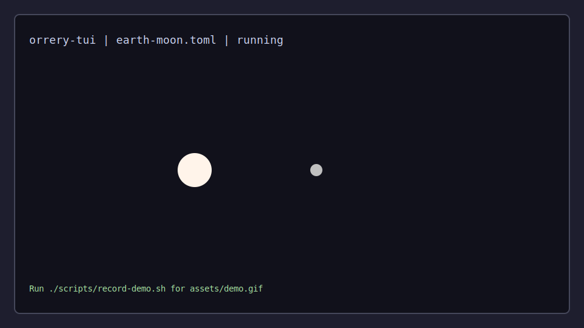
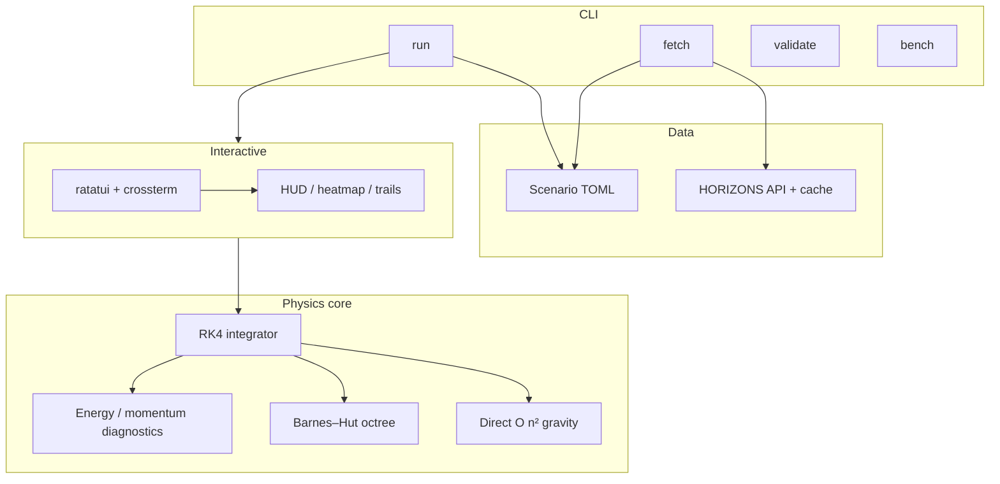

# orrery-tui

**A Newtonian N-body simulator in your terminal** — real NASA HORIZONS ephemerides, RK4 integration, Barnes–Hut gravity, and a ratatui UI with trails, heatmaps, and orbital diagnostics.



Record an animated GIF for releases: `./scripts/record-demo.sh` (requires [VHS](https://github.com/charmbracelet/vhs)) → `assets/demo.gif`.

[](https://github.com/VremennoiParadox/orrery-tui/actions/workflows/ci.yml)


> **Status:** v0.1.0 — feature-complete for the initial roadmap (Phases 0–6). See [Roadmap](#roadmap) and [PLANNING.md](PLANNING.md).

## Why orrery-tui exists

Orbital mechanics is easier to trust when you can **see** energy drift, switch between direct O(n²) gravity and Barnes–Hut, and drop in real Solar System state vectors from JPL. orrery-tui packages that into a single Rust binary with no GUI framework — only Unicode, 24-bit color, and honest physics notes.

## Features

- **RK4** integration with softened Newtonian gravity (SI internally)
- **NASA JPL HORIZONS** fetch, cache, and offline scenario rebuild
- **Barnes–Hut** octree (tunable θ) for larger systems
- **TUI**: pan, zoom, trails, gravitational field heatmap, scenario switcher, HUD sparkline
- **TOML scenarios** plus procedural asteroid belt generation
- **Headless** mode and **Criterion** benchmarks

## Installation

### From source (recommended)

```bash
git clone https://github.com/VremennoiParadox/orrery-tui.git
cd orrery-tui
cargo build --release
./target/release/orrery-tui --help
```

### crates.io (after publish)

```bash
cargo install orrery-tui
orrery-tui run scenarios/earth-moon.toml
```

**Requirements:** Rust 1.75+, a true-color terminal (Kitty, Alacritty, Ghostty, etc.).

## Quick start

```bash
# Interactive Earth–Moon
cargo run --release -- run scenarios/earth-moon.toml

# Headless sanity check
cargo run --release -- run scenarios/earth-moon.toml --headless --steps 1000

# Figure-eight choreography
cargo run --release -- run scenarios/figure-eight.toml

# Solar System (bundled HORIZONS snapshot)
cargo run --release -- run scenarios/solar-system.toml

# Stress test (128 asteroids + Barnes–Hut)
cargo run --release -- run scenarios/asteroid-belt.toml
```

## Controls (TUI)

| Key | Action |
|-----|--------|
| `Space` | Pause / resume |
| `+` / `-` | Zoom in / out |
| `0` | Reset zoom |
| Arrows / `hjkl` | Pan |
| `Tab` / `Shift+Tab` | Select next / previous body |
| `f` | Follow selected body |
| `F` | Frame all bodies |
| `1` / `2` / `3` | XY / XZ / YZ projection |
| `T` | Toggle trails |
| `H` | Toggle HUD |
| `g` | Toggle gravitational field heatmap |
| `c` | Toggle center-of-mass marker |
| `e` / `p` | Toggle energy / momentum diagnostics |
| `o` | Cycle overlay presets |
| `s` | Scenario switcher |
| `v` | Validate current scenario |
| `Shift+R` | Reload scenario from disk |
| `B` | Toggle Barnes–Hut / direct gravity |
| `b` | Toggle octree debug stats (Barnes–Hut) |
| `.` / `,` | Increase / decrease time warp |
| `[` / `]` | Decrease / increase dt |
| `r` | Reset simulation |
| `?` | Help |
| `q` / `Esc` | Quit |
| Mouse click | Select nearest body |
| Mouse drag | Pan |
| Mouse wheel | Zoom at cursor |

## Scenarios

| File | Bodies | Notes |
|------|--------|-------|
| `scenarios/earth-moon.toml` | 2 | Bound two-body demo |
| `scenarios/figure-eight.toml` | 3 | Sensitive choreography; small `dt` |
| `scenarios/solar-system.toml` | 11 | HORIZONS barycentric snapshot |
| `scenarios/asteroid-belt.toml` | 129 | Sun + 128 procedural asteroids |

```bash
cargo run --release -- list-scenarios
cargo run --release -- validate scenarios/earth-moon.toml
```

Full schema: [docs/scenarios.md](docs/scenarios.md).

## NASA HORIZONS data

Fetch fresh ephemerides and write `scenarios/solar-system.toml`:

```bash
cargo run --release -- fetch solar-system --date 2026-06-01
cargo run --release -- validate scenarios/solar-system.toml
```

Cache: `~/.cache/orrery-tui/horizons/raw/`. Use `--offline` after the first fetch, or `--force` to refresh.

Details: [docs/horizons.md](docs/horizons.md).

## Physics model

- **Gravity:** softened Newtonian summation; optional **Barnes–Hut** (3D octree, opening angle θ).
- **Integrator:** fixed-step **RK4**.
- **Diagnostics:** energy, momentum, COM; HUD orbital estimates.

```toml
[physics.barnes_hut]
enabled = true
theta = 0.7
```

Deep dive: [docs/physics.md](docs/physics.md).

## Screenshots

Static captures live in [assets/screenshots/](assets/screenshots/). Regenerate the animated demo:

```bash
./scripts/record-demo.sh   # requires VHS — see assets/README.md
```

## Architecture



| Module | Role |
|--------|------|
| `src/physics/` | Bodies, gravity, RK4, Barnes–Hut, field sampling |
| `src/scenario/` | TOML load/validate, asteroid belt generator |
| `src/horizons/` | HTTP client, parser, cache, solar-system writer |
| `src/render/` | Camera, canvas, heatmap, HUD |
| `src/app.rs` | Main loop, input, state |

## Development

```bash
cargo check
cargo fmt --all
cargo clippy --all-targets -- -D warnings
cargo test
```

See [CONTRIBUTING.md](CONTRIBUTING.md).

## Benchmarks

```bash
cargo run --release -- bench
cargo bench --bench direct_vs_barnes_hut
```

Barnes–Hut typically wins at hundreds+ bodies; direct is fine for small systems.

## Roadmap

| Done (v0.1) | Possible next |
|-------------|----------------|
| RK4 + direct gravity | Symplectic integrators |
| HORIZONS fetch + cache | More ephemeris presets |
| TUI + heatmap + Barnes–Hut | Collision detection |
| Scenario TOML + asteroid belt | `cargo deny` / audit in CI |
| CI + docs | Split crates (`orrery-tui-core`, …) |

Full historical plan: [PLANNING.md](PLANNING.md).

## Limitations

- Point masses only; no tides, relativity, or atmosphere.
- Barnes–Hut is approximate; use direct mode or smaller θ when accuracy matters.
- HORIZONS gives initial conditions only — orbits are not re-fetched during simulation.
- Chaotic systems (figure-eight) need small `dt`; large `dt` shows visible energy drift.
- Kitty graphics protocol is stubbed; core rendering is Unicode cells.

## Contributing

Contributions welcome — read [CONTRIBUTING.md](CONTRIBUTING.md) and [CODE_OF_CONDUCT.md](CODE_OF_CONDUCT.md). Open an [issue](https://github.com/VremennoiParadox/orrery-tui/issues) before large changes.

## License

Licensed under either of [Apache-2.0](LICENSE-APACHE) or [MIT](LICENSE-MIT) at your option.

## Acknowledgements

- NASA JPL [HORIZONS](https://ssd.jpl.nasa.gov/horizons/) ephemeris system  
- [ratatui](https://ratatui.rs/) and the Rust scientific computing ecosystem
